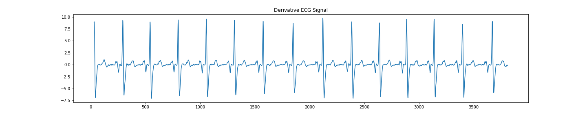

# QRS Detection from ECG signals ⭐

A dependable QRS recognition algorithm has numerous applications. A popular technique is the computer interpretation of the 12-lead ECG. Arrhythmia monitors are now widely used in coronary care units. Holter tape recording, which is widely used, necessitates a Holter scanning device that includes a QRS detector to analyse the tapes much faster than in real-time. Arrhythmia monitors for ambulatory patients that analyse the ECG in real time are currently in development. When an arrhythmia occurs, such a monitor can be programmed to immediately store an interval of the abnormal ECG for subsequent transmission to a central station where a physician can interpret it. 

Such a device necessitates highly accurate QRS recognition. False detection results in unnecessary data transmission to the central station or requires an extensive memory to store any ECG segments that are captured unnecessarily. As a result, an accurate QRS detector is an essential component of many ECG instruments.

## Pan Tompkins Algorithm 🔥

The Pan-Tompkins algorithm can be broken down in the following steps: 

### Signal Processing

* Bandpass filtering:  A bandpass filter is created by a combination of a high pass filter and a low pass filter. The signal is first filtered with a low pass filter and the output of the low pass filter is given to a high pass filter. The function of the filter is to eliminate noise due to muscle contractions, T-waves, or any other noise present in the data. The implementation  is on the lines with Pan Tompkin's research paper 

* Derivative: The implementation is as given in the research paper. It is used to get the slope information for the QRS complex. It takes the filtered signal as an input.

* Squaring: This just squares all the values in the waveform. It provides a non-linear amplification to the higher frequency components of QRS complexes in the derivative signal.

* Moving window integration: It is a kind of running average within a window of certain size. Here I took a window of 0.15 seconds. This basically serves as a tool for detection and finding features of QRS complexes and R peaks

### R-Peak Detection and calculation of heart-rates
* **Fudicial Mark**: A fudicial mark of the locations(wrt time) of all the possbile QRS complexes is created. The QRS complexes are marked by rising edges in the integrated waveform. To create the fudicial mark we use the differentiated signal, and try to see the slope change from postive to negative. We further keep track of moving window thresholds to filter out peaks which are not of QRS complex (not R peaks)

* **Maintaining sinal and noise thresholds:** The thresholds are maintained for both the noise and the signal peaks. The calculation of the next step of each threshold depends on the previouly found peaks. Thresholds are able to adapt quickly to rapidly changing heart rates by keeping running estimates of both signal and noise levels from previous peak assignments. They help in peak detection also. The criteria and the formulas are given in the pan tompkins paper.

* **RR intervals and their limits:** Two heartbeats are needed to establish the average RR interval and rate limits. If any of the eight most recent sequential beats fall outside the the accepted low and high RR-interval limits, heart rate is considered to be irregular and the signal and noise thresholds are reduced by half in order to increase sensitivity.
Searchback: During normal sinus rhythm, if a QRS complex is not identified within 166 percent of the average of the previous eight beats, it is assumed that a QRS complex has been missed. A searchback procedure is then initiated, with the goal of identifying the greatest peak within the current signal and noise thresholds as a candidate for a QRS complex. There are certain criterias requried for the peak to qualify as an R peak.

* **T-wave Identification:** Once a QRS complex has been discovered, there is a 200-ms refractory period during which another beat is physically impossible, allowing for the eradication of any QRS detection within this time frame. If a QRS is discovered after the refractory period but before 360 ms after the preceding QRS, we must determine whether this peak is a true QRS complex or a T-wave. A T-wave is diagnosed when the slope of its peak is less than half of the slope of the previous QRS.

Following all the steps, we are able to detect QRS complexes and thus R-peaks and heart rates using RR intervals.

## Results :bar_chart:
**To perform QRS detection on ECG signals from the MIT-BIH Arrhythmia Database.**

### Record 100

 
 
 
 
 
 

### Record 101

 
 
 
 
 
 

### Record 102

 
 
 
 
 
 

### Record 103

 
 
 
 
 
 

### Record 104

 
 
 
 
 
 

### Record 105

 
 
 
 
 
 

### Record 106

 
 
 
 
 
 

### Record 107

 
 
 
 
 
 

### Record 108

 
 
 
 
 
 

### Record 109

 
 
 
 
 
 

## Observations :notebook:

To recognise QRS complexes in real-time, ambiance of noise and rapidly changing and varied ECG morphologies, the Pan-Tompkins algorithm employs filtering, adaptive thresholding, criterias based on human heart physiology etc. There are many applications to the algorithm. A lot of times it is used to calculate just the R-peaks instead of the whole QRS complex, and thus it has a lot of applications in Heart Rate Variability(HRV). Since the algorithm is a real-time algorithm, it also has applications in heart-rate calculations in reat time.

Overall the algorithms does a good job in identifying peaks and QRS complexes apart from all the noise and other factors

## Instructions to Run :runner:

* The dataset is being downloaded from the given hashed link. However if at a later point of time, the dataset is not available in the input file, kindly use the dataset present in the repository in place of the downloaded data. 

* To run, open the colab file and select the signal number using the slider given. Then run the corresponding cells to get the results

## References and Credits 💳

1. Pan, J. and Tompkins, W., 1985. A Real-Time QRS Detection Algorithm. IEEE Transactions on Biomedical Engineering, BME-32(3), pp.230-236.
